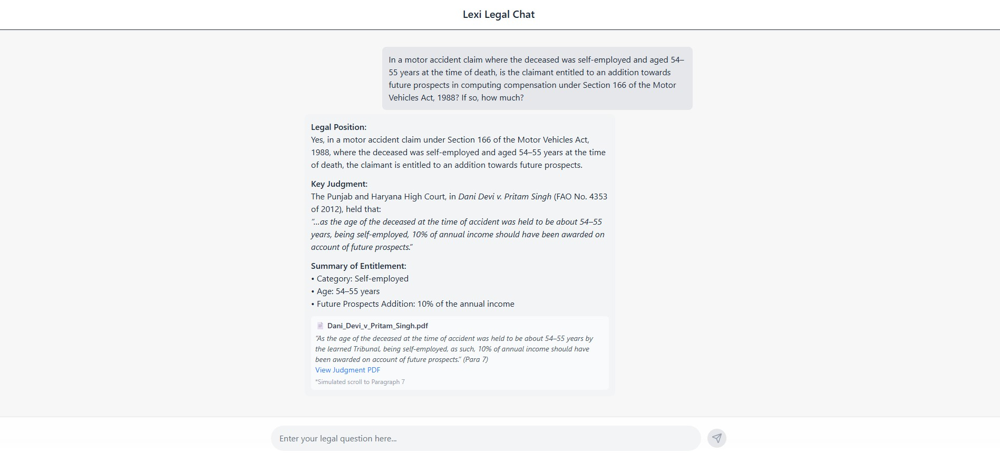

# Lexisg-frontend-intern-test

This is my submission for the **Lexi Frontend Internship Assignment**.  
It simulates a ChatGPT-style legal assistant that allows users to ask legal questions and receive AI-generated answers with supporting citations.

---

## 📸 Screenshot




---

## 🚀 Features

- 💬 Chat-style UI (inspired by ChatGPT dark theme)
- ✍️ Input legal queries and simulate response
- 📄 View structured AI-generated legal answer
- 🧾 Citation block below the response with PDF link
- 🔗 Clicking citation opens judgment PDF in a new tab
- 📜 Simulated scroll to Paragraph 7 (not supported by SharePoint)
- 🧰 Icons for future extensibility (voice, file upload, tools)

---

## 🧪 How to Run Locally

```bash
git clone https://github.com/YOUR_USERNAME/Lexisg-frontend-intern-test.git
cd Lexisg-frontend-intern-test
npm install
npm start
